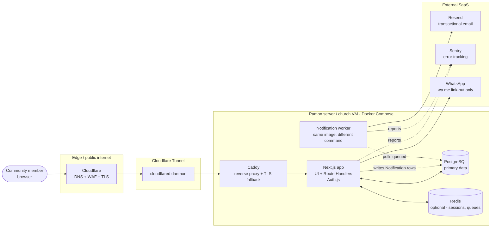
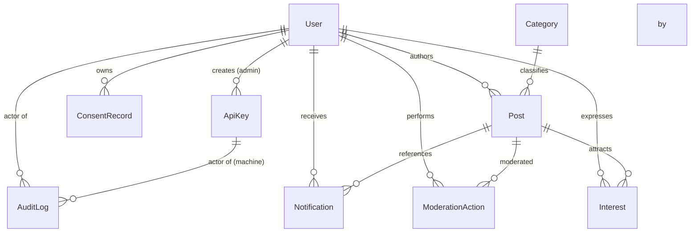
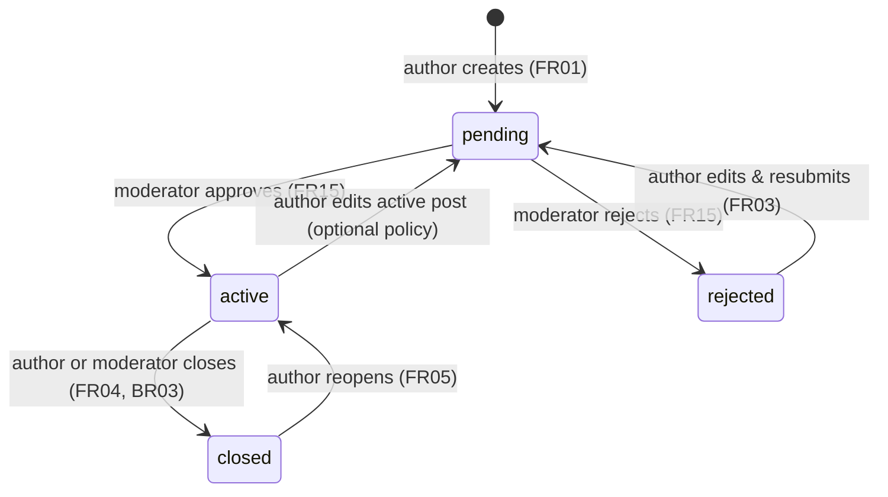
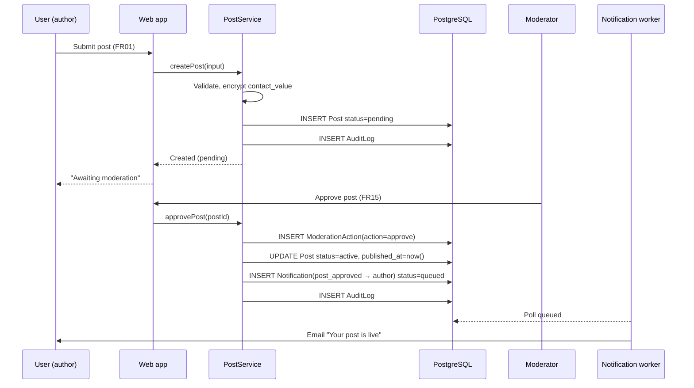
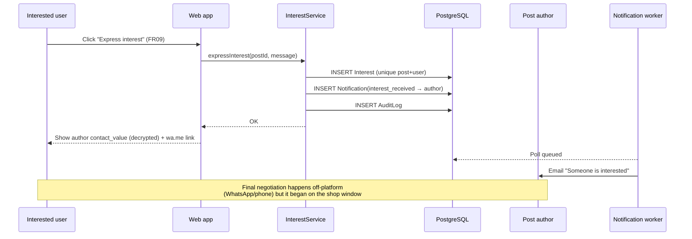
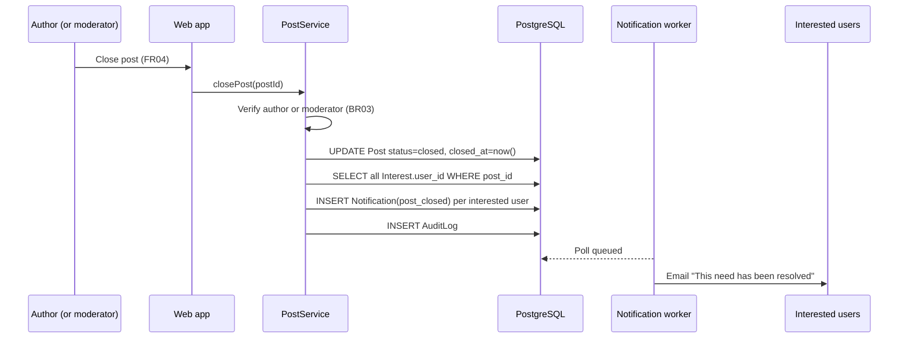
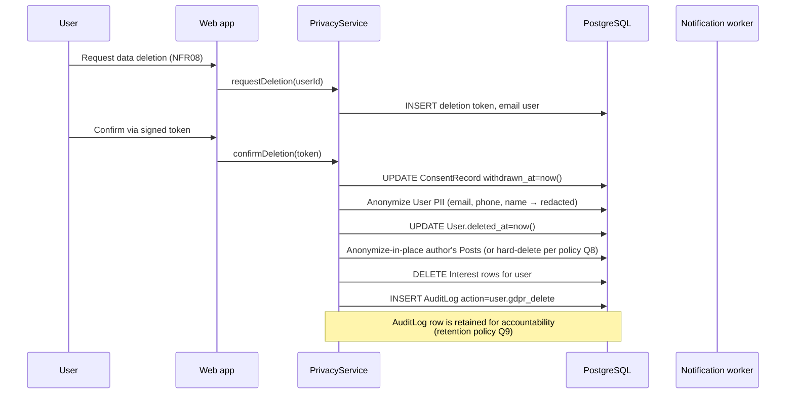

# ARCHITECTURE.md — "Precisa-se" (Casa da Cidade Community Platform)

> **Status:** DRAFT v0.3 — for stakeholder review.
> **Last updated:** 2026-07-20.
> **Audience:** project team (Ramon, Tiago, Rafaela, Rui, Gabriel, Rafael Santos) + implementing agents/LLMs.
> **How to propose changes:** open a discussion at the next alignment meeting, then edit this file and bump the version. Mark anything contested with `Open question:` so unresolved items stay visible.

---

## 1. Document header

This document is the **architecture counterpart** to `docs/MVP.md` (requirements) and `CLAUDE.md` (project context/people). Where MVP.md says *what* and *why*, this document says *how*.

It is intentionally opinionated: a default path is recommended for every layer, with runner-ups noted. The team can override any decision; the rationale is recorded so future readers understand the trade-off that was made.

Conventions used throughout:
- `Assumption:` — something this draft assumes but the team has not explicitly confirmed.
- `Open question:` (Q1, Q2, …) — a decision still required from stakeholders. All are consolidated in §12.
- `FR` / `BR` / `NFR` codes refer to entries in `docs/MVP.md`.

---

## 2. Goals & non-goals

### 2.1 Goals (MVP)
- Match **needs** with **offers** across two categories: **volunteering** and **donations** (FR01–FR05).
- Provide a central **"shop window"** listing with search and filters (FR06–FR08).
- Allow off-platform contact while keeping the platform central (FR09–FR11).
- Provide moderator-driven quality control (FR15–FR16, BR01).
- Be **responsive**, **i18n-ready** (pt-PT default), and **GDPR/LGPD-compliant** from day one (NFR01, NFR03–NFR08).
- Run on modest self-hosted infrastructure (Ramon's 16GB server + Cloudflare Tunnel) with a clean path to church VMs (NFR10–NFR12).

### 2.2 Non-goals (deferred to phase 2+)
- Paid jobs / recruitment matching.
- WhatsApp bot as an entry interface.
- Volunteer reputation / "Golden Plus" auto-publishing.
- Payments of any kind (BR07 — hard rule).
- Native mobile apps (NFR01 — hard rule).
- Unification with the existing church app.

These non-goals are revisited in **§11 (Extensibility & phase-2 readiness)** to confirm the architecture accommodates them without rework.

---

## 3. High-level architecture

### 3.1 System overview

The MVP is a **single deployable web application** (frontend + API co-located) backed by PostgreSQL, fronted by a reverse proxy behind Cloudflare Tunnel. A separate worker process handles asynchronous notifications.



**Why a single deployable?** The MVP is small (tens to a few hundred active posts, NFR15), the team is small, and Next.js App Router lets UI and API evolve together without an orchestration tax. Splitting into separate frontend/backend services is a phase-2 option (§11) once scale or team structure demands it.

**Why a separate worker process?** Notifications (email to author on interest, broadcast on closure) must be retries-with-backoff, not blocking request handlers. The worker runs the **same Docker image**, just a different entrypoint command, so there's no second codebase to maintain.

### 3.2 Logical layers

| Layer | Responsibility | Technology |
|---|---|---|
| Presentation | SSR/RSC pages, forms, locale routing | Next.js App Router, React Server Components, Tailwind CSS |
| API / Route Handlers | REST-ish endpoints invoked by the UI; RBAC checks | Next.js Route Handlers (TypeScript) |
| Service layer | Business rules (state machine, authorization, consent) | Plain TypeScript modules under `src/server/services/` |
| Data access | ORM + migrations | Prisma |
| Persistence | Primary store | PostgreSQL 16 |
| Notifications | Async email/WA dispatch | Worker process + Resend API |
| Observability | Errors, logs, health | Sentry + structured logs + `/health` |

---

## 4. Technology selection

Each layer below lists the **recommended** option, the **runner-up**, and the **why**. All choices assume a cost-conscious, self-host-friendly context (church/non-profit).

### 4.1 Frontend framework
- **Recommended:** **Next.js (App Router) + TypeScript + Tailwind CSS**.
- **Runner-up:** Remix (now React Router v7).
- **Why:** App Router's React Server Components let the public listing (the "shop window") render server-side for fast first paint and SEO, while still allowing interactivity where needed. TypeScript is non-negotiable for a small team — it catches the category of bugs that a church-volunteer-driven QA process would otherwise miss. Tailwind keeps styling low-ceremony and consistent. Remix is a credible alternative; Next.js wins on ecosystem size and i18n tooling maturity.
- **Rejected:** SPA-only (React/Vite) — worse SEO and slower shop-window load; Astro — its content-first model fights the authenticated post-CRUD use case.

### 4.2 Backend / API
- **Recommended:** **Next.js Route Handlers in the same app** (TypeScript).
- **Runner-up:** Separate Fastify or NestJS service, or a Django/FastAPI service if the team prefers Python.
- **Why:** One deployable, one language, one auth context (Auth.js cookies shared across UI and API). For MVP scale this is the right shape.
- **Open question Q1:** backend language — Node/TypeScript (recommended, same-team as frontend) vs. Python (richer ORM ecosystem, but adds a second runtime to operate).

### 4.3 Database
- **Recommended:** **PostgreSQL 16**, accessed via **Prisma**.
- **Runner-up:** MariaDB/MySQL.
- **Why:** PostgreSQL gives us GIN/trigram indexes for keyword search over title+description (FR07) without standing up a separate search engine, `jsonb` for extensible per-category attributes (§5.4, NFR13), and mature backup tooling. Prisma provides typed access, declarative migrations, and a schema file that doubles as documentation. **SQLite is explicitly rejected** — it cannot meet the multi-environment, daily-backup-with-NAS-replication requirement (NFR11) cleanly.
- **Open question Q2:** managed Postgres (e.g., a small cloud instance) vs. self-hosted in Docker. Recommendation: self-host in Docker on Ramon's server for MVP (cost), revisit at migration.

### 4.4 Authentication & authorization
- **Recommended:** **Auth.js (NextAuth v5)** with a **credentials provider**, **argon2id** password hashing, and a **role enum** (`user`, `moderator`, `admin`, `service`).
- **Runner-up:** Hosted/OIDC provider — Keycloak, Authentik, Clerk, or Supabase Auth.
- **Why:** Self-hosting keeps data inside the church's trust boundary and avoids per-seat SaaS costs. argon2id is the current OWASP-recommended password hash. Auth.js gives session cookies, CSRF protection, and Route-Handler-friendly middleware out of the box.
- **Machine clients (bot / agents / 3rd-party):** authenticated by a separate **service-token scheme** (long-lived bearer tokens in `Authorization: Bearer <token>`), validated in middleware alongside the cookie path. A `service` role marks these actors; fine-grained capability is encoded as **scopes** on the `ApiKey` row (§5.1). See §4.9 for the full external-API design.
- **Open question Q3:** self-hosted Auth.js (recommended, lower cost, data stays in-house) vs. hosted provider (less to operate, but introduces an external dependency and possible cost).
- **Open question Q4:** MFA for moderator/admin accounts (recommended yes — moderators are the highest-value accounts). Implementation: TOTP via `otplib`.

### 4.5 Notifications
- **Recommended:** **Resend** for transactional email; **WhatsApp is link-out only** (`wa.me/<number>`) for the MVP.
- **Runner-up (email):** church SMTP relay; Amazon SES.
- **Why:** Resend has a generous free tier, clean API, and good deliverability — enough for MVP volume. WhatsApp Business API is genuinely complex and costly (Meta approval, template messaging, per-conversation pricing) and is explicitly out of MVP scope. The platform will generate `wa.me` deep links so users still get the convenience of jumping into WhatsApp, but the contact is made *through* the platform's "express interest" action — preserving the shop-window invariant (R1).
- **Open question Q5:** which transactional email provider — Resend (recommended), church SMTP relay (no cost, more ops), or SES (cheapest at scale, more setup).

### 4.6 Internationalization
- **Recommended:** **next-intl**, with **pt-PT as default**, locale-prefixed routing (`/pt-PT/...`, `/en/...`, `/pt-BR/...`), and message catalogs as JSON.
- **Runner-up:** `react-intl`; raw Next.js i18n routing.
- **Why:** next-intl is purpose-built for the App Router, supports server components, and handles locale-aware formatting (dates, numbers) consistently. JSON catalogs are easy for non-developers (e.g., Rafaela) to review and edit.
- **Hard rule (enforced by lint):** no hardcoded user-facing strings in components; everything goes through `useTranslations()` / `getTranslations()`. This is the only way to honor NFR03 without retrofitting pain later.

### 4.7 Containerization, reverse proxy, tunneling
- **Recommended:** **Docker Compose** orchestrating: `web`, `worker`, `db`, `caddy` (reverse proxy), `cloudflared` (tunnel daemon), `backup` (scheduled pg_dump), and optionally `redis`.
- **Runner-up (proxy):** Traefik, Nginx.
- **Why:** Caddy is one of the simplest reverse proxies to operate, with automatic HTTPS as a fallback if the tunnel is bypassed. Cloudflare Tunnel removes any need to expose inbound ports on the host — traffic egresses from the server to Cloudflare, so the home/church network stays closed. Compose is the right orchestration level until the project outgrows a single host.
- **Open question Q6:** is TLS termination at Cloudflare acceptable to Rafael Santos? (It means Cloudflare briefly sees plaintext for the leg between their edge and the tunnel daemon. For a community platform this is normally fine, but the church IT lead should confirm.)

### 4.8 Observability
- **Recommended:** **Sentry** for error tracking (frontend + backend), **structured JSON logs** to stdout (captured by Docker), and a `/health` endpoint that pings the DB and worker liveness.
- **Why:** Sentry's free tier covers MVP volume. Structured logs are greppable and ship-to-anything later. `/health` is the minimum for any orchestrator or uptime check.

### 4.9 External API (bot / agent / 3rd-party readiness)
- **Recommended:** a **versioned REST surface at `/api/v1/*`** layered on top of the same Next.js Route Handlers and service layer the UI already uses, plus a **service-token (API-key) auth scheme** for machine clients.
- **Runner-up:** GraphQL (overkill for MVP — one client shape); an entirely separate backend service (rejected: breaks the single-deployable invariant, §3.1).
- **Why:** the WhatsApp bot (phase 2), AI agents such as Hermes, and eventual 3rd-party tools all need a programmatic contract. Building it as a versioned namespace *on the same app* gives us a public API for free — no second codebase, no second runtime to operate, no duplicated business rules. The shop-window and moderation invariants (R1, BR01) stay enforced in the service layer regardless of caller.
- **Scope of v1 (MVP-aligned):**
    - `GET /api/v1/posts` — list/search active posts (shop window, FR06–FR08).
    - `GET /api/v1/posts/{id}` — read a single post.
    - `POST /api/v1/posts` — create a post (always `pending`; moderation still required, BR01).
    - `POST /api/v1/posts/{id}/interest` — express interest (triggers contact reveal + author notification, FR09).
    - `GET /api/v1/categories` — list categories.
    - Webhook-style: `POST /api/v1/webhooks/post-status` — opt-in callbacks for post state changes (§5.3), so agents/Hermes can react without polling.
- **Auth model (dual-path, unified RBAC):**
    - **Browser UI** → Auth.js session cookie (existing, §4.4).
    - **Machine clients (bot, Hermes, 3rd-party)** → `Authorization: Bearer <service-token>`; token maps to an `ApiKey` row with a `service` role + **scopes** (`post:read`, `post:write`, `interest:create`, `webhook:subscribe`).
    - **Middleware** accepts either credential, resolves a single `authContext` (`{ kind: 'user'|'service', actor_id, role, scopes }`). RBAC and invariant checks in the service layer (§7.2) are identical for both paths — defense in depth does not depend on the caller being a browser.
- **Operational hardening:**
    - **Versioning:** `/api/v1/*` is a frozen contract; breaking changes go to `/api/v2/*`. UI-internal handlers (no `v1` prefix) may drift freely.
    - **Rate limiting:** per-token limits at the edge (Cloudflare) and/or in middleware; bot/agent tokens get their own tier. (Open question Q18.)
    - **Idempotency:** `POST /posts` and `POST /interest` accept an `Idempotency-Key` header to make retries safe for agents.
    - **OpenAPI spec** generated from the v1 handlers; published at `/api/v1/openapi.json` and a developer-facing docs page. This is what an agent framework or 3rd-party integrator points at.
    - **Auditability:** every v1 write creates an `AuditLog` row with `actor_api_key_id` populated (§5.1, §7.6), so machine-driven actions are never anonymous.
- **Hard invariants preserved regardless of caller:**
    - R1 (shop window): contact info is revealed **only** via `POST /interest`. A bot or agent may *create* or *list* posts, but never broker contact inline — it must deep-link the user to the platform. Enforced in `InterestService`, not in the caller.
    - BR01 (moderation): a service-created post is still `pending` until a human moderator approves it. No "trusted bot bypass" in MVP.
    - NFR03 (i18n): API responses are locale-neutral; localized strings are keyed (`category.volunteering`) so any client renders in its own locale.
- **Phase-2 features that slot in unchanged:** the Hermes agent and WhatsApp bot use the same v1 endpoints as a future 3rd-party partner; the only difference is which `ApiKey` + scopes they hold. No new data model, no new service.
- **Open question Q18:** rate-limit policy and quota per API key (defaults + paid tier for 3rd-party?).
- **Open question Q19:** is a public, unauthenticated read of the shop window via `/api/v1/posts` acceptable (consistent with Q15's anonymous-browsing assumption), or must every API read carry a token?

---

## 5. Data model

All tables use **UUID primary keys** (`gen_random_uuid()`), `created_at`, and `updated_at` timestamps. Timestamps are **UTC** `timestamptz`. Soft-delete is used **only** on `User` (for audit referential integrity); other entities are hard-deleted or status-flagged.

### 5.1 Entities

#### User
| Field | Type | Constraints | Notes |
|---|---|---|---|
| id | uuid | PK | |
| email | citext | unique, not null | login identifier |
| password_hash | text | not null | argon2id |
| display_name | text | not null | |
| phone_e164 | text | nullable | E.164-normalized |
| role | enum(`user`,`moderator`,`admin`) | not null, default `user` | |
| locale | text | not null, default `pt-PT` | UI preference |
| consent_at | timestamptz | nullable | most recent ConsentRecord timestamp |
| deleted_at | timestamptz | nullable | soft-delete; PII redacted on set |
| created_at / updated_at | timestamptz | not null | |

#### Category
| Field | Type | Constraints | Notes |
|---|---|---|---|
| id | uuid | PK | |
| slug | text | unique, not null | e.g. `volunteering`, `donation`, future `jobs` |
| key | text | not null | i18n catalog key, e.g. `category.volunteering` |

Categories are a **lookup table** (not an enum) so future phases add `jobs` without a migration of every Post.

#### Post
| Field | Type | Constraints | Notes |
|---|---|---|---|
| id | uuid | PK | |
| author_id | uuid | FK→User, not null | |
| category_id | uuid | FK→Category, not null | |
| type | enum(`request`,`offer`) | not null | |
| status | enum(`pending`,`active`,`closed`,`rejected`) | not null, default `pending` | state machine (§5.3) |
| title | text | not null | locale of author at creation |
| description | text | not null | |
| contact_method | enum(`phone`,`whatsapp`,`email`) | not null | |
| contact_value | bytea | not null | **encrypted at app layer** (see §7.4) |
| locale | text | not null | content locale |
| extra_attributes | jsonb | default `'{}'` | phase-2 extension hook (§5.4) |
| published_at | timestamptz | nullable | set on `pending→active` |
| closed_at | timestamptz | nullable | set on `→closed` |
| rejected_reason | text | nullable | set on `→rejected` |
| search_vector | tsvector | generated | `to_tsvector(locale, title \|∣ description)` |
| created_at / updated_at | timestamptz | not null | |

Indexes: `(status, category_id, type)` for the shop-window listing; GIN on `search_vector` and on a `pg_trgm` index over `(title, description)` for keyword search.

#### Interest
| Field | Type | Constraints | Notes |
|---|---|---|---|
| id | uuid | PK | |
| post_id | uuid | FK→Post, not null | |
| user_id | uuid | FK→User, not null | who expressed interest |
| message | text | nullable | optional intro from interested user |
| created_at | timestamptz | not null | |

Unique constraint: `(post_id, user_id)` — one interest per user per post. On Post closure, all Interest rows for that Post are the recipient list for the closure notification (FR11).

#### ModerationAction
| Field | Type | Constraints | Notes |
|---|---|---|---|
| id | uuid | PK | |
| post_id | uuid | FK→Post, not null | |
| moderator_id | uuid | FK→User, not null | |
| action | enum(`approve`,`reject`,`remove`) | not null | |
| reason | text | nullable | required on `reject` |
| created_at | timestamptz | not null | |

The latest ModerationAction per Post wins (BR02). This is an **append-only audit of moderation decisions**.

#### ConsentRecord
| Field | Type | Constraints | Notes |
|---|---|---|---|
| id | uuid | PK | |
| user_id | uuid | FK→User, not null | |
| scope | enum(`terms`,`privacy`,`marketing`) | not null | |
| version | text | not null | policy version accepted |
| granted_at | timestamptz | not null | |
| withdrawn_at | timestamptz | nullable | GDPR withdrawal |

#### Notification
| Field | Type | Constraints | Notes |
|---|---|---|---|
| id | uuid | PK | |
| recipient_id | uuid | FK→User, not null | |
| post_id | uuid | FK→Post, nullable | |
| type | enum(`interest_received`,`post_approved`,`post_rejected`,`post_closed`) | not null | |
| payload | jsonb | not null | template variables |
| channel | enum(`email`,`in_app`) | not null | WhatsApp is link-out, never a Notification channel in MVP |
| status | enum(`queued`,`sent`,`failed`) | not null, default `queued` | |
| attempts | int | not null, default 0 | |
| last_error | text | nullable | |
| sent_at | timestamptz | nullable | |
| created_at | timestamptz | not null | |

#### AuditLog
| Field | Type | Constraints | Notes |
|---|---|---|---|
| id | uuid | PK | |
| actor_id | uuid | FK→User, nullable | nullable for system actions |
| actor_api_key_id | uuid | FK→ApiKey, nullable | set when the actor is a machine client (§4.9); mutually exclusive with `actor_id` for non-system rows |
| action | text | not null | e.g. `post.create`, `user.gdpr_delete` |
| target_type | text | not null | e.g. `Post`, `User` |
| target_id | uuid | nullable | |
| before | jsonb | nullable | |
| after | jsonb | nullable | |
| ip | inet | nullable | |
| user_agent | text | nullable | |
| created_at | timestamptz | not null | |

#### ApiKey
Machine-client credentials for the external API (§4.9). One row per bot, agent (e.g. Hermes), or 3rd-party integration.

| Field | Type | Constraints | Notes |
|---|---|---|---|
| id | uuid | PK | |
| name | text | not null | human label, e.g. `hermes-agent`, `whatsapp-bot`, `partner-acme` |
| hashed_token | text | unique, not null | argon2id hash of the bearer token; raw token shown once at creation |
| prefix | text | not null | first 8 chars of raw token, for display/lookup without hashing |
| role | enum(`service`) | not null, default `service` | machine actors are always `service` (§4.4) |
| scopes | text[] | not null, default `'{}'` | e.g. `{post:read, post:write, interest:create, webhook:subscribe}` |
| created_by | uuid | FK→User, not null | the admin who minted it |
| last_used_at | timestamptz | nullable | updated on successful auth |
| revoked_at | timestamptz | nullable | soft-revoke; non-null means rejected |
| created_at / updated_at | timestamptz | not null | |

### 5.2 Relationships



### 5.3 Post state machine

A Post is in exactly one state at a time (BR02). New posts always start as `pending` because every post requires moderator approval in the MVP (BR01).



Notes:
- `rejected → pending`: editing a rejected post resets it to `pending` (re-approval needed). This is safer than auto-re-publishing.
- `active → pending` on edit is a **policy choice** (Q7); the default draft assumes edits to live posts keep them `active` but log a ModerationAction for visibility.

### 5.4 Extensibility hook (`extra_attributes`)

`Post.extra_attributes` (jsonb) is the seam for phase-2 categories. Examples:

- **Jobs (phase 2):** `{ "employment_type": "full_time", "salary_range": "..." }`.
- **Golden Plus reputation (phase 2):** a separate `ReputationScore` table keyed by `user_id`, plus a rule that authors above a threshold skip `pending` (i.e., auto-`active`). This requires only a service-layer change, not a schema restructure.
- **WhatsApp bot (phase 2):** the bot writes Posts via the same Route Handlers the UI uses, with a service account role — no new data model.

Because `Category` is a lookup table, adding `jobs` is one seed row + one i18n key + one optional validator on `extra_attributes`.

### 5.5 i18n in the schema

- **User-generated content** (Post title/description) is stored in the **author's locale** (`Post.locale`) and **not auto-translated**. The shop-window listing shows content as authored; the UI chrome (filters, buttons, dates) is localized per viewer.
- **Catalog content** (Category names, UI strings) lives in next-intl JSON files keyed by `Category.key`.
- `Assumption:` automatic translation of posts is out of MVP scope. We can revisit if the community turns out to be strongly bilingual.

---

## 6. Key flows

### 6.1 Post creation → moderation → publication



### 6.2 Express interest → author notification → off-platform contact



### 6.3 Post closure → notify all interested users



This flow is what kills R2 (duplicate/wasted contacts): once closed, the post disappears from the shop window and every prior interested party is told to stop.

### 6.4 GDPR data deletion request



---

## 7. Security & privacy design

### 7.1 Authentication
- argon2id password hashing (OWASP-recommended).
- Auth.js session cookies, `HttpOnly`, `Secure`, `SameSite=Lax`.
- Optional **TOTP MFA for moderator/admin** (Q4 — recommended yes).

### 7.2 Authorization (RBAC)
- Roles: `user`, `moderator`, `admin`.
- UI hides forbidden actions **and** every Route Handler re-checks RBAC (defense in depth).
- Only the post's author or a moderator can close it (BR03) — enforced in `PostService.closePost`, not just in the UI.

### 7.3 Transport & network
- HTTPS everywhere (Cloudflare Tunnel + Caddy fallback).
- No inbound ports opened on the host; traffic egresses to Cloudflare.
- Internal services (`db`, `redis`) bound to the Compose network only — never exposed to the host.

### 7.4 PII & secrets
- **Contact values are encrypted at the application layer** (libsodium `crypto_secretbox`, key from an env var) before being written to `Post.contact_value`. This means a DB dump alone does not leak contacts.
- PII is **never logged**. The logger redacts known-PII fields.
- Secrets (DB password, encryption key, Resend API key, Auth.js secret) come from a `.env` file (or Docker secrets at phase 2), never committed.
- `Assumption:` `.env.example` is committed with placeholder values; real `.env` is gitignored.

### 7.5 Consent & GDPR/LGPD
- Sign-up requires accepting current `terms` and `privacy` scopes (ConsentRecord with version).
- Withdrawal + deletion flow in §6.4.
- Privacy policy versioned; changes require fresh consent.
- `Open question Q8:` audit-log retention post-deletion — legal counsel needed. Suggest 12 months pending guidance.

### 7.6 Audit
- Every state-changing Route Handler writes an AuditLog row (actor, action, before/after, ip, user_agent). This is implemented as a service-layer wrapper, not left to each handler to remember.

---

## 8. Infrastructure & deployment

### 8.1 Docker Compose layout (MVP)

```
services:
  web:        Next.js app (UI + Route Handlers), depends on db
  worker:     Same image, command=notification worker, depends on db
  db:         postgres:16, volume-backed
  redis:      optional — session store / future queue
  caddy:      reverse proxy + fallback TLS
  cloudflared: tunnel daemon, egress-only
  backup:     scheduled pg_dump → NAS-replicated volume
```

### 8.2 Environment separation (NFR12)
- `docker-compose.staging.yml` and `docker-compose.prod.yml` override the base.
- Staging uses its own database container and a staging Cloudflare Tunnel hostname.
- Database migrations run via `prisma migrate deploy` on container start.

### 8.3 Backup (NFR11)
- `backup` service runs a scheduled `pg_dump` (e.g., daily at 02:00) to a volume that is replicated off-host — consistent with the church's existing daily-replicated NAS practice (Tiago's and Rafa/Rui's NAS).
- Retention: rolling 30 days daily + 12 months monthly (recommended defaults; Q10 to confirm with church IT).
- A restore drill is part of the staging environment's job — restore the latest backup into staging weekly.

### 8.4 CI pipeline sketch
- On push: `pnpm install` → lint (incl. i18n key parity check) → `tsc` → unit/integration tests → build.
- On merge to `main`: build image, push to registry, deploy to **staging**, run smoke tests.
- **Manual approval gate** → deploy to **prod**.
- CI runs `prisma migrate deploy` against the target environment before the new app container starts.

### 8.5 Phase-2 migration path to church VMs
- Compose file is host-agnostic. Moving to a church VM means: copy compose + `.env`, restore latest backup, repoint Cloudflare Tunnel credential.
- `Open question Q11:` who operates the production host after handoff (Rafael Santos / church IT) — confirm transition timing.

---

## 9. Observability (NFR14)

- **Errors:** Sentry (frontend + backend), source maps uploaded on release.
- **Logs:** structured JSON to stdout, captured by Docker logging driver. No PII. Key fields: `request_id`, `user_id` (or `anon`), `route`, `status`, `duration_ms`, `error`.
- **Health:** `GET /health` returns DB ping + worker last-run timestamp. Used by Docker healthchecks and an external uptime monitor.
- **Metrics (light):** counts of posts created/approved/closed, notifications sent/failed — emitted to logs initially; promote to a metrics backend only if needed.

---

## 10. Internationalization architecture

- **Library:** next-intl.
- **Default locale:** `pt-PT`. Supported at launch: `pt-PT` (default), `en`, `pt-BR`.
- **Routing:** locale-prefixed (`/pt-PT/`, `/en/`, `/pt-BR/`). Root `/` redirects to the user's `Accept-Language`-detected locale (falling back to `pt-PT`).
- **Catalogs:** `messages/{locale}.json`. Keys namespaced by feature (`post.create.title`, `category.volunteering`).
- **Lint rule (hard):** no hardcoded user-facing strings in JSX; everything via `useTranslations()` / `getTranslations()`. CI fails the build on violations.
- **CI parity check:** a script asserts every locale file has the same set of keys; missing keys fail CI.
- **Formatting:** dates and numbers via next-intl's `format` helpers (`Intl.DateTimeFormat`, `Intl.NumberFormat`) — never `Date.toLocaleString()` with a hardcoded locale.
- **RTL readiness (NFR06):** use logical CSS properties (`margin-inline-start`, not `margin-left`) so adding an RTL locale later is feasible without restyling.
- **Adding a locale:** drop a `messages/{locale}.json` file, add the locale to the config, deploy. No code changes.

---

## 11. Extensibility & phase-2 readiness

| Deferred feature | How it plugs in | What changes |
|---|---|---|
| **Jobs/recruitment** | New `Category` row `jobs` + optional `extra_attributes` validator | 1 seed row + 1 i18n key + (optional) form-specific UI; data model untouched (BR05) |
| **Golden Plus reputation** | New `ReputationScore` table; service rule: high-score authors skip `pending` | 1 table + a check in `PostService.createPost`; no schema restructure |
| **WhatsApp bot** | Bot calls `/api/v1/*` (§4.9) with its own `ApiKey` (`service` role + scopes) | No new data model — uses existing ApiKey/external-API design. **Invariant:** bot deep-links to the platform, never brokers contact inline (R1) |
| **AI agents (e.g. Hermes)** | Same `/api/v1/*` surface as WhatsApp bot; per-agent `ApiKey` + scopes | Zero new infrastructure; one ApiKey row per agent |
| **3rd-party tools / partners** | Same `/api/v1/*` surface; partner `ApiKey` with narrower scopes | Zero new infrastructure; rate-limited per Q18 |
| **Church-app unification** | Church app calls `/api/v1/*` (§4.9) with a service token | Already designed — no additional auth scheme to invent |
| **Auto-translation of posts** | Background job translates `Post.title`/`description`, stores in a `PostTranslation` table | New table; shop-window falls back to original on miss |

The architecture is intentionally **boring and additive**: each phase-2 feature is one new table or one new role, not a rewrite.

---

## 12. Open questions

These are the decisions still required from the team. The implementing agent must surface them, not guess.

> **Resolved since v0.2** (kept in place with a `RESOLVED:` marker so the original rationale stays legible; see the commit referenced inline): Q1, Q3, Q4, Q5, Q7. The unresolved ones (Q2, Q6, Q8–Q19) are genuine stakeholder decisions — infra handoff, retention policy, moderation policy — and remain open.

- **Q1** — Backend language: Node/TypeScript (recommended) vs. Python. **RESOLVED:** Node/TypeScript — current implementation.
- **Q2** — Postgres: self-hosted in Docker (recommended for MVP) vs. managed cloud instance.
- **Q3** — Auth: self-hosted Auth.js (recommended) vs. hosted provider (Clerk/Supabase/Keycloak). **RESOLVED:** self-hosted Auth.js v5 — see `src/auth.ts`.
- **Q4** — MFA for moderator/admin: recommended yes. **RESOLVED:** TOTP MFA implemented (`src/server/services/mfa-service.ts`, `src/app/[locale]/account/mfa/`, `signin/mfa-challenge/`) — commit `014c755`.
- **Q5** — Transactional email provider: Resend (recommended) vs. church SMTP vs. SES. **RESOLVED:** Resend (`src/server/notifications/mailer.ts`, `docs/ops/resend-setup.md`) — commit `014c755`.
- **Q6** — Is Cloudflare TLS termination acceptable to Rafael Santos (church IT)?
- **Q7** — Editing an *active* post: keep it `active` (recommended) or reset to `pending`? **RESOLVED:** keep `active` — `PostService.editActivePost` keeps status; the edit form deliberately omits type/category.
- **Q8** — Audit-log retention after GDPR deletion — needs legal counsel (suggest 12 months pending).
- **Q9** — On GDPR deletion, anonymize the user's Posts in place (recommended) or hard-delete them?
- **Q10** — Backup retention schedule — confirm with church IT (suggested: 30 daily + 12 monthly).
- **Q11** — Who operates the production host after handoff to church VMs, and when?
- **Q12** — Domain strategy: subdomain of `casadacidade.com` vs. own domain.
- **Q13** — Who owns QA before launch? (MVP.md §6.4) Suggested split: Rafaela owns the test checklist, Ramon owns test infrastructure.
- **Q14** — Moderation policy detail: is "remove" (post taken down after being live) a distinct action from "reject" (never went live), or do we collapse them? (Draft treats them as distinct for audit clarity.)
- **Q15** — Anonymous browsing of the shop window vs. login-required? Draft assumes **anonymous browsing, login to act** — confirm.
- **Q16** — Should interested users see the author's contact immediately, or only after the author accepts the interest? Draft assumes immediately (lower friction, FR09). Revisit if spam appears.
- **Q17** — Image attachments for posts (e.g., photos of donated items)? Not in MVP scope; `Assumption:` text-only for v0.1.
- **Q18** — External API rate-limit policy and quota per `ApiKey` (defaults for bot/agent tier vs. potential paid tier for 3rd-party partners). (§4.9)
- **Q19** — Is unauthenticated read of `/api/v1/posts` acceptable (consistent with the Q15 anonymous-browsing assumption), or must every API call — including reads — carry a service token? (§4.9)

---

## 13. Risks & mitigations (architecture-level)

> Business/project risks are in `docs/MVP.md` §7. This section covers architecture-specific risks.

| Risk | Mitigation |
|---|---|
| **Single-server SPOF** — Ramon's server is one host | Daily backups to two NASes (NFR11); documented restore drill; phase-2 migration to church VMs with second host |
| **Cloudflare dependency** — Tunnel + DNS are external | Caddy can serve directly over HTTPS as fallback; documented runbook for tunnel outage |
| **Moderation bottleneck** — every post needs a human (BR01) | Multiple moderators (`role=moderator` is a set, not one person); phase-2 Golden Plus reduces volume |
| **PII at rest** — contact data is sensitive | App-layer encryption of `Post.contact_value`; PII never logged; soft-delete + anonymize on GDPR request |
| **i18n drift** — locale catalogs fall out of sync | CI key-parity check + lint rule forbidding hardcoded strings |
| **Shop-window erosion** — usage slides back to WhatsApp | Notifications deep-link to the platform; contact is revealed only via the "express interest" action; metrics on posts/interests over time |
| **Migration pain to phase 2** | `extra_attributes` jsonb + lookup-table Category mean additive changes, not rewrites |

---

## 14. Glossary

- **FR / BR / NFR** — Functional Requirement / Business Rule / Non-Functional Requirement, as numbered in `docs/MVP.md`.
- **Shop window** — the public listing of active posts; the platform's reason to exist. Cannibalizing it (e.g., to WhatsApp) is the top project risk (R1).
- **Golden Plus** — joking name from the kickoff for a future trusted-volunteer reputation tier that lets high-trust authors publish without moderator approval. Out of MVP scope.
- **Need / Offer** — `Post.type`. A *need* is a request ("I need X"); an *offer* is something someone provides ("I can do/give X").
- **Interest** — a recorded intent by a user to follow up on a Post. The trigger for revealing contact info and notifying the author.
- **State machine (Post)** — the lifecycle `pending → active → closed` (with `rejected` and reopen paths); see §5.3.
- **PII** — Personally Identifiable Information (email, phone, name). Encrypted at app layer; never logged.
- **RBAC** — Role-Based Access Control. Roles here: `user`, `moderator`, `admin`.
- **Auth.js** — NextAuth v5, the recommended auth library.
- **next-intl** — the recommended i18n library for the Next.js App Router.
- **Cloudflare Tunnel** — an egress-only tunnel that exposes the host to the internet without opening inbound ports.
